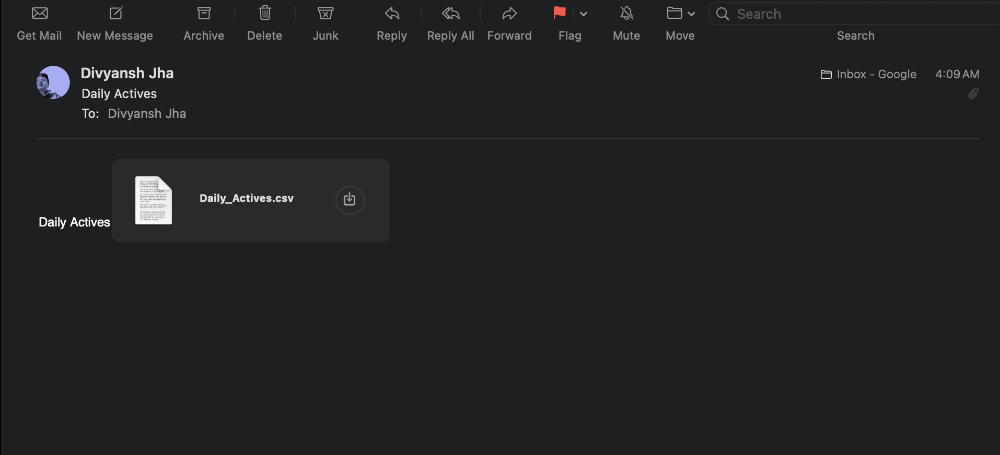

# Web Scraping Go Project

## Overview

This project demonstrates how to scrape financial data from Yahoo Finance and send a daily report via email using either Gmail or Outlook. It leverages the power of Go's concurrency model to efficiently scrape data and the `gomail` package for sending emails. The project is designed to be modular, allowing easy adjustments for different scraping targets or email providers.

## Features

- **Web Scraping**: Efficiently scrapes financial data from Yahoo Finance.
- **Concurrency**: Utilizes Go's concurrency features for fast data retrieval.
- **Email Reporting**: Sends a daily report containing scraped data via email.
- **Flexible Configuration**: Supports Gmail and Outlook SMTP servers with minimal configuration changes.

## Getting Started

### Prerequisites

- Go installed on your system.
- A Gmail or Outlook account for sending emails.

### Installation

Clone the repository and navigate into the project directory:

```bash
git clone https://github.com/itsdivyanshjha/web-scraping-go.git
cd web-scraping-go
```

Ensure you have Go installed and your `$GOPATH` is set up correctly.

### Configuration

Before running the scraper, you need to configure your email settings. Create a `.env` file in the root of the project with the following structure:

```plaintext
EMAIL=your_email@example.com
PASSWORD=your_email_password_or_app_password
SMTP_HOST=smtp.example.com
SMTP_PORT=587
```

Replace the placeholders with your actual email credentials and SMTP server details.

### Running the Scraper

To run the scraper, execute the following command in your terminal:

```bash
go run scraper.go
```

This will start the web scraping process and send the collected data via email according to your configuration.

Excel Sheet Generated:


Mail Sent:



## License

This project is licensed under the MIT License - see the [LICENSE](LICENSE) file for details.

## Contact

For questions or feedback, please write to me at jhadivyansh29@gmail.com
```

Make sure to replace `yourusername` and `your_email@example.com` with your actual  username and email addresses.